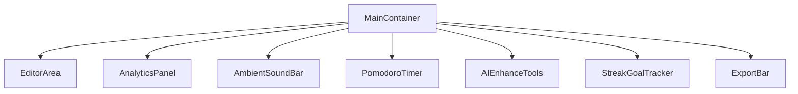

# SereneWrite Main Container – Requirements Document

## 1. Purpose

SereneWrite is a minimalist, distraction-free web application designed for writing journals, essays, or short books. Its aim is to foster creativity and productivity by providing users with a calming, intuitive environment that supports focus, self-improvement, and consistent writing habits. Key features include real-time writing analytics, calming ambient soundscapes to enhance focus, a Pomodoro timer for efficient work sessions, AI-powered writing enhancement tools, writing streak and goal tracking, and straightforward options to export publish-ready or print-friendly output.

---

## 2. User-Facing Features

SereneWrite’s main container will eventually offer the following core features, enabled through modular React subcomponents:

### 2.1 Minimalist Writing Editor
- Central, full-width writing area
- Distraction-free by default (controls/tools hidden or minimized; appear on demand)
- Supports journal, essay, or short book writing

### 2.2 Writing Analytics
- Real-time word and character count
- Tracking of time spent in the editor
- Visual indication of daily writing streaks and progress toward writing goals

### 2.3 Ambient Soundscapes
- Users can play and adjust calming ambient background sounds to aid focus
- Planned to use `howler.js` for playback/control

### 2.4 Pomodoro Mode
- Built-in Pomodoro timer with notifications/break suggestions
- Customizable session and break lengths

### 2.5 AI Writing Enhancement & Style Tools
- AI-powered suggestions for style, grammar, tone, and clarity
- Options to rephrase, condense, or expand content
- Placeholder/mock implementation at this stage, with plans for more robust AI integration in subsequent iterations

### 2.6 Streak & Goal Tracker
- Real-time feedback on current writing streak
- Goal-setting for word count, time, or session streaks
- Visual progress indicators

### 2.7 Export/Print-Ready Output
- Export writing in clean, publishable, or print-ready formats (e.g., PDF, styled HTML)
- Simple export/share functionality directly from the interface

---

## 3. Components/Subsystems

The main container will coordinate the following modular subcomponents, each designed for independent development and future extensibility:

- **EditorArea:** The core writing interface with focus on minimalism and smooth text editing.
- **AnalyticsPanel:** Displays word count, time spent, streak and goal progress.
- **AmbientSoundBar:** Interface for starting/stopping/choosing ambient sounds.
- **PomodoroTimer:** Pomodoro session controls and timers.
- **AIEnhanceTools:** UI for AI-powered editing, style, and creative assistance.
- **StreakGoalTracker:** Visual indicator and configuration for streaks and goals.
- **ExportBar:** Export and print options accessible without leaving main writing view.

A high-level example layout (to be implemented using React’s component structure):

---

## 4. Technology Stack

### 4.1 Frontend
- **Framework:** React JS (ES6+)
- **Styling:** Tailwind CSS (planned integration; not yet present in codebase)
- **Language:** JavaScript (ES6+)

### 4.2 Third-party Libraries
- **howler.js:** Planned for ambient soundscape playback/control (not currently installed)
- **AI enhancement tools:** Placeholder/mocks in early iterations (no back-end or real LLM integration yet)

### 4.3 Other Utilities and Tooling
- Uses basic project setup with React Scripts
- ESLint with React-specific linting
- No backend; all data and state are client-side

*Note:* As of the current state, neither Tailwind CSS nor howler.js are installed. The requirements reflect strategic intent and will require these dependencies to be included as development progresses.

---

## 5. Visual / UX Requirements

- **Theme:** Modern, calming light theme using soft, neutral colors, and subtle shadow effects (`primary: #F5F6FA`, `secondary: #22223B`, `accent: #A3CEF1`). The default demo uses CSS variables, but Tailwind will provide scalable, utility-based styling.
- **Distraction-Free:** Controls, toggles, and analytics are hidden or minimized, only shown as ephemeral overlays or on user interaction (hover, focus, etc.).
- **Responsiveness:** Must be accessible and attractive on desktops, tablets, and mobile browsers.
- **Typography:** Clean, high-contrast fonts for relaxation and easy reading.
- **Feedback:** Subtle interaction animations or highlights for actions (e.g., starting timer, exporting, toggling sound).
- **Accessibility:** Sufficient contrast, keyboard navigation support, and ARIA roles/tags where appropriate.

---

## 6. Implementation Notes & Scope

- The current codebase is a clean, minimal React starter (see `/serenewrite_web_app`). No significant implementations of the described features exist yet; only basic page shell, style, and template code are present.
- All core features are to be constructed as *modular React components* under a single app container, enabling future extensibility and iterative feature additions.
- The development approach assumes the inclusion and configuration of Tailwind CSS and howler.js as first steps toward the feature plan.

---

## 7. Future Backlog & Open Points

- Integration with actual AI tools and/or cloud backends for enhancement and user history.
- Richer export options (Markdown, PDF, etc.) using open-source libraries.
- Persisting user progress (browser local storage at minimum).
- Internationalization support for interface and help text.

---

## 8. References

- [Project Starter Template README](../serenewrite_web_app/README.md)
- [App Main Layout](../serenewrite_web_app/src/App.js)
- [Planned Libraries:](https://howlerjs.com/), [Tailwind CSS](https://tailwindcss.com/)

---

*Document prepared for initial feature planning and stakeholder review; subject to revision as the SereneWrite application evolves.*
